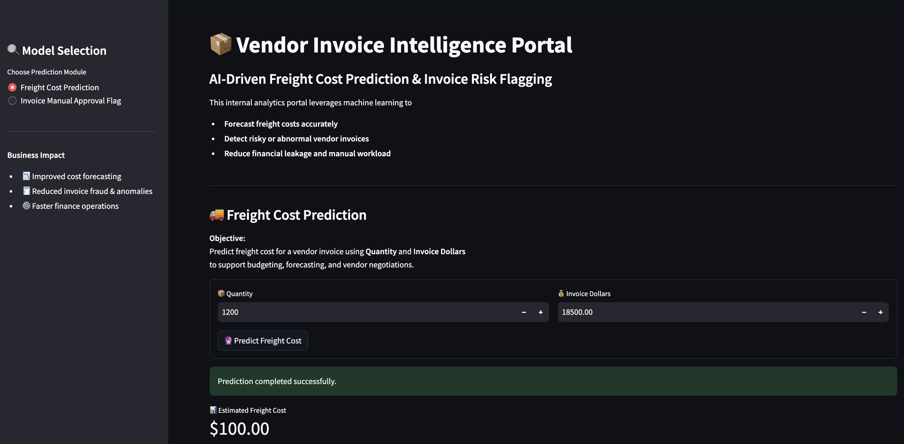

# Vendor Invoice Intelligence System  
**Freight Cost Prediction & Invoice Risk Flagging**

## 📌 Table of Contents
- <a href="#project-overview">Project Overview</a>
- <a href="#business-objectives">Business Objectives</a>
- <a href="#data-sources">Data Sources</a>
- <a href="#eda">Exploratory Data Analysis</a>
- <a href="#models-used">Models Used</a>
- <a href="#metrics">Evaluation Metrics</a>
- <a href="#application">Application</a>
- <a href="#project-structure">Project Structure</a>
- <a href="#how-to-run-this-project">How to Run This Project</a>
- <a href="#author--contact">Author & Contact</a>
---

<h2><a class="anchor" id="project-overview"></a>📌 Project Overview</h2>

This project implements an **end-to-end machine learning system** designed to support finance teams by:

1. **Predicting expected freight cost** for vendor invoices.
2. **Flagging high-risk invoices** that require manual review due to abnormal cost, freight, or operational patterns.

---

<h2><a class="anchor" id="business-objectives"></a>🎯 Business Objectives</h2>

### 1. Freight Cost Prediction (Regression)

**Objective:**  
Predict the expected freight cost for a vendor invoice using quantity, invoice value, and historical behavior.

**Why it matters:**
- Freight is a non-trivial component of landed cost.
- Poor freight estimation impacts margin analysis and budgeting.
- Early prediction improves procurement planning and vendor negotiation.


---

### 2. Invoice Risk Flagging (Classification)

**Objective:**  
Predict whether a vendor invoice should be flagged for manual approval due to abnormal cost, freight, or delivery patterns.

**Why it matters:**
- Manual invoice review does not scale.
- Financial leakage often occurs in large or complex invoices.
- Early risk detection improves audit efficiency and operational control.


---

<h2><a class="anchor" id="data-sources"></a>📂 Data Sources</h2>

Data is stored in a relational SQLite database (`inventory.db`) with the following tables:

- `vendor_invoice` – Invoice-level financial and timing data  
- `purchases` – Item-level purchase details  
- `purchase_prices` – Reference purchase prices  
- `begin_inventory`, `end_inventory` – Inventory snapshots  

SQL aggregation is used to generate **invoice-level features**.

---

<h2><a class="anchor" id="eda"></a>📊 Exploratory Data Analysis (EDA)</h2>

EDA focuses on **business-driven questions**, such as:

- Do flagged invoices have higher financial exposure?
- Does freight scale linearly with quantity?
- Does freight cost depend on quantity?

Statistical tests (t-tests) are used to confirm that flagged invoices differ meaningfully from normal invoices.

---

<h2><a class="anchor" id="models-used"></a>🤖 Models Used</h2>

### Regression (Freight Prediction)
- Linear Regression (baseline)
- Decision Tree Regressor
- Random Forest Regressor (final model)

### Classification (Invoice Flagging)
- Logistic Regression (baseline)
- Decision Tree Classifier
- Random Forest Classifier (final model with GridSearchCV)

Hyperparameter tuning is performed using **GridSearchCV** with F1-score to handle class imbalance.

---

<h2><a class="anchor" id="metrics"></a>📈 Evaluation Metrics</h2>

### Freight Prediction
- MAE
- RMSE
- R² Score

### Invoice Flagging
- Accuracy
- Precision, Recall, F1-score
- Classification report
- Feature importance analysis

---

<h2><a class="anchor" id="application"></a>🖥 End-to-End Application</h2>

A **Streamlit application** demonstrates the complete pipeline:

- Input invoice details
- Predict expected freight
- Flag invoices in real time
- Provide human-readable explanations

---

<h2><a class="anchor" id="project-structure"></a>📁 Project Structure</h2>

```bash
inventory-invoice-analytics/
│
├── data/
│   └── inventory.db
│
├── freight_cost_prediction/
│   ├── data_preprocessing.py
│   ├── model_evaluation.py
│   └── train.py
│
├── invoice_flagging/
│   ├── data_preprocessing.py
│   ├── model_evaluation.py
│   ├── model_evaluation.py
│   └── train.py
│
├── inference/
│   ├── predict_freight.py
│   └── predict_invoice_flag.py
│
├── models/
│   ├── predict_freight_model.pkl
│   ├── scaler.pkl
│   └── predict_flag_invoice.pkl
│
├── notebooks/
│   ├── Invoice Flagging.pkl
│   └── Predict Freight Cost.ipynb
│
├── app.py
├── README.md
└── .gitignore
```

---

<h2><a class="anchor" id="how-to-run-this-project"></a>How to Run This Project</h2>

1. Clone the repository:
```bash
git clone https://github.com/yourusername/inventory-invoice-analytics.git
```
2. Train and Save Best Fit Models:
```bash
python freight_cost_prediction/train.py
python invoice_flagging/train.py
```
3. Test Models:
```bash
python inference/predict_freight.py
python inference/predict_invoice_flag.py
``` 
4. Open Application:
```bash
streamlit run app.py
```

---
<h2><a class="anchor" id="author--contact"></a>Author & Contact</h2>

**Ayushi Mishra**  
Data Scientist  
📧 Email: techclasses0810@gmail.com  
🔗 [LinkedIn](https://www.linkedin.com/in/ayushi-mishra-30813b174/)  
🔗 [Portfolio](https://www.youtube.com/@techclasses0810/)


